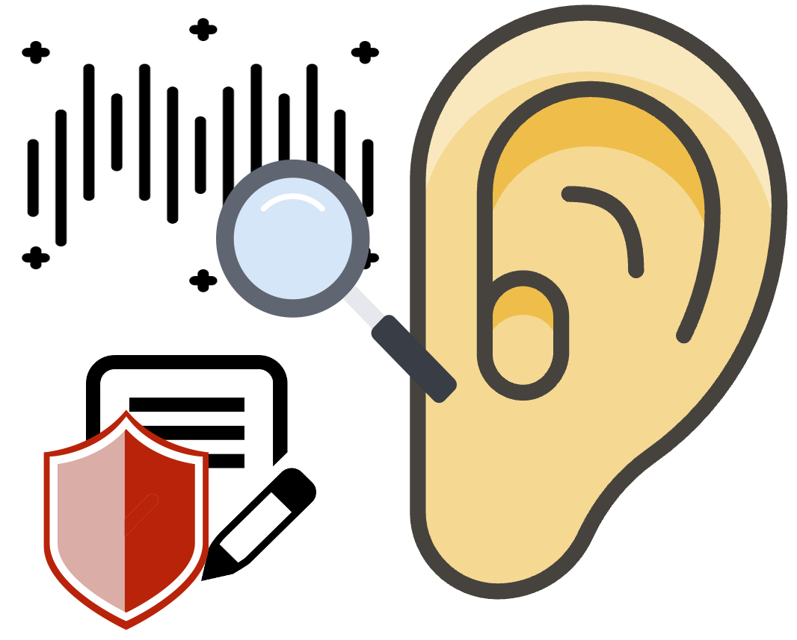
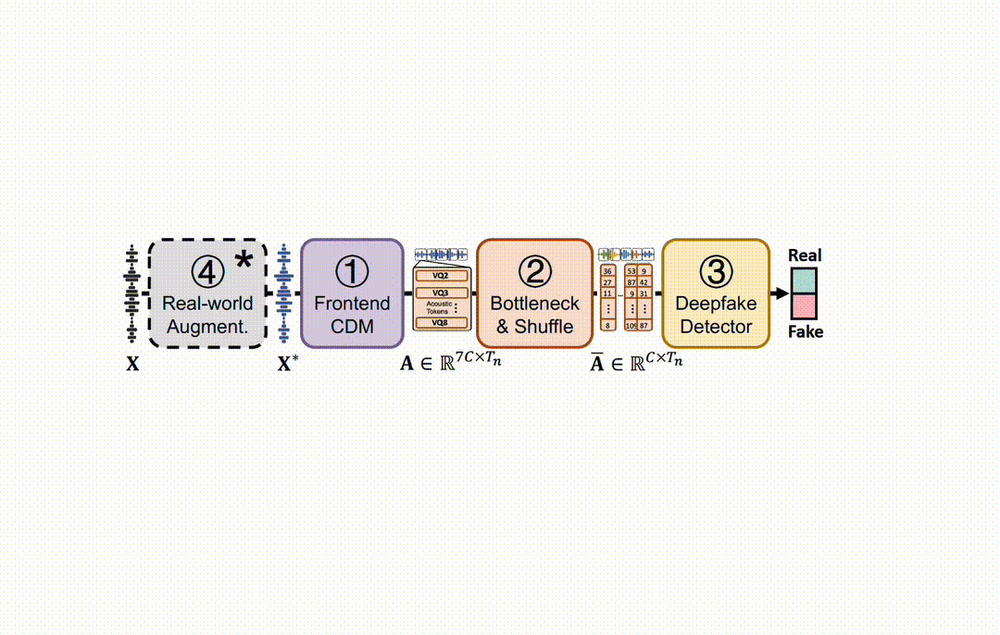
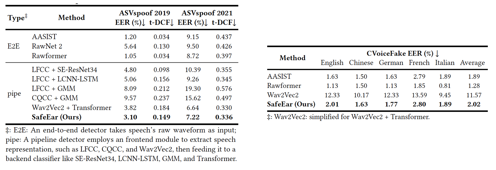
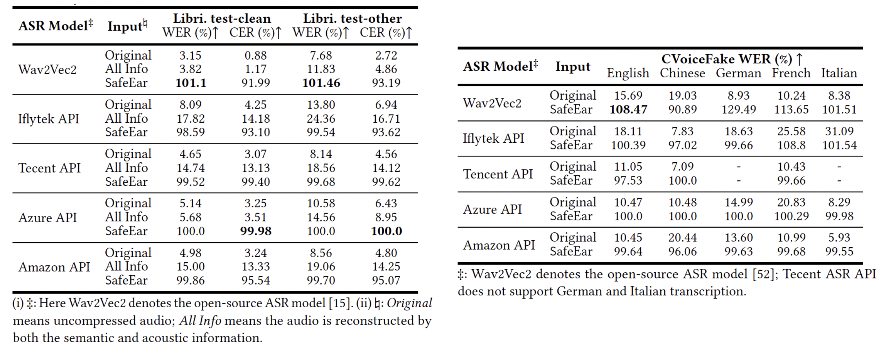

# <font color=E7595C>Safe</font><font color=F6C446>Ear</font>: <font color=E7595C>Content Privacy-Preserving</font> <font color=F6C446>Audio Deepfake Detection</font>

[](https://arxiv.org/abs/2409.09272)
[](https://makeapullrequest.com) 
[](https://creativecommons.org/licenses/by/4.0/)


By [1] Zhejiang University, [2] Tsinghua University.
* [Xinfeng Li](https://letterligo.github.io)* [1], [Kai Li](https://cslikai.cn)* [2], Yifan Zheng [1], Chen Yan† [1], Xiaoyu Ji [1], Wenyuan Xu [1].

This repository is an official implementation of the SafeEar accepted to **ACM CCS 2024** (Core-A*, CCF-A, Big4) .

Please also visit our <a href="https://safeearweb.github.io/Project/">website</a>.

## ✨Key Highlights:

In this paper, we propose SafeEar, a novel framework that aims to detect deepfake audios without relying on accessing the speech content within. Our key idea is to devise a neural audio codec into a novel decoupling model that well separates the semantic and acoustic information from audio samples, and only use the acoustic information (e.g., prosody and timbre) for deepfake detection. In this way, no semantic content will be exposed to the detector. To overcome the challenge of identifying diverse deepfake audio without semantic clues, we enhance our deepfake detector with multi-head self-attention and codec augmentation. Extensive experiments conducted on four benchmark datasets demonstrate SafeEar’s effectiveness in detecting various deepfake techniques with an equal error rate (EER) down to 2.02%. Simultaneously, it shields five-language speech content from being deciphered by both machine and human auditory analysis, demonstrated by word error rates (WERs) all above 93.93% and our user study. Furthermore, our benchmark constructed for anti-deepfake and anti-content recovery evaluation helps provide a basis for future research in the realms of audio privacy preservation and deepfake detection.

## 🚀Overall Pipeline



## 🔧Installation

1. Clone the repository:

```shell
git clone git@github.com:LetterLiGo/SafeEar.git
cd SafeEar/
```

2. Create and activate the conda environment:

```shell
conda create -n safeear python=3.8 
conda activate safeear
```

3. Install PyTorch and torchvision following the [official instructions](https://pytorch.org). The code requires `python>=3.8`, `pytorch>=1.11`, `torchvision>=0.13`.

4. Install other dependencies:

```shell 
pip install -r requirements.txt
```

## 📊Model Performance
### ASVspoof 2019 & 2021

### Speech Recognition Performance


## 📚Training

Before starting training, please modify the parameter configurations in [`configs`](configs).

Use the following commands to start training:

```shell
python train.py --conf_dir config/train19.yaml
python train.py --conf_dir config/train21.yaml
```

## 📈Testing/Inference

To evaluate a model on one or more GPUs, specify the `CUDA_VISIBLE_DEVICES`, `dataset`, `model` and `checkpoint`:

```shell
python test.py --conf_dir Exps/ASVspoof19/conf.yml
python test.py --conf_dir Exps/ASVspoof21/conf.yml
```

## 📜Citation

If you find our work helpful, please consider citing:

```
@inproceedings{li2024safeear,
  author       = {Xinfeng Li and Kai Li and Yifan Zheng and Chen Yan and Xiaoyu Ji and Wenyuan Xu},
  title        = {SafeEar: Content Privacy-Preserving Audio Deepfake Detection},
  booktitle    = {Proceedings of the 2024 {ACM} {SIGSAC} Conference on Computer and Communications Security (CCS)
  year         = {2024},
}
```
